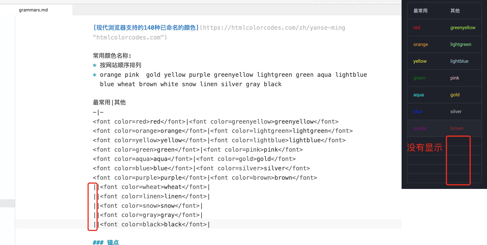
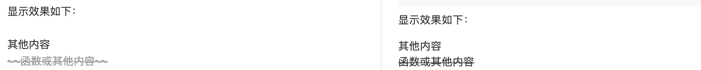
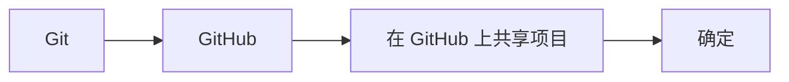

# Markdown 语法学习


> <span id="top">**文章开头**</span>

- **编者：林海城**  
- **日期：2024.10.18**  

此笔记学习摘抄自[菜鸟教程](https://www.runoob.com/markdown/md-image.html){target="_blank"} 、[杨希杰的个人网站](https://yang-xijie.github.io/BLOG/Markdown/grammars/){target="_blank"} 、[Markdown语法大全(超级版)](https://www.jianshu.com/p/ebe52d2d468f){target="_blank"} ，并根据笔者的使用不断更新，基本使用应该足够。

点击[这里](#now)回到下方介绍锚点 `跳转` 的阅读位置

点击[这里](#catalog)回到下方介绍目录 `TOC` 的阅读位置

[TOC]

## 语言介绍


Markdown 是一种轻量级标记语言，它允许人们使用易读易写的纯文本格式编写文档。
Markdown 语言在 2004 由约翰·格鲁伯（英语：John Gruber）创建。

Markdown 编写的文档可以导出 HTML 、Word、图像、PDF、Epub 等多种格式的文档。

Markdown 编写的文档后缀为 .md 或 .markdown，常用在编写电子书，如：Gitbook。

当前许多网站都广泛使用 Markdown 来撰写帮助文档或是用于论坛上发表消息。例如：GitHub、简书等。

GitHub支持的语法：[GitHub Guides | Mastering Markdown](https://guides.github.com/features/mastering-markdown/){target="_blank"}

`markdown`有不少扩展的语法，我们主要学习它最基础的语法，和一些`GitHub`支持的语法，因为我们之后写`markdown`文件可能主要是用来写项目的`README.md`，而这些项目的代码仓库，我们很可能就在`GitHub`存放。


## Markdown工具介绍

正所谓工欲善其事，必先利其器，有一个好的编辑工具可以事半功倍，以下是几个我推荐的markdown编辑器。

### Typora

[Typora官网](https://www.typora.io){target="_blank"}

所见即所得的`markdown`编辑软件，全平台；各种意义上都应该是`markdown`编辑的首选！

主要用来写单独的markdown（比如我今天要写讲稿了，用markdown写的话我就会考虑Typora）；也可以开一个文件夹专门放自己的笔记……

### VS Code

安装插件`Markdown All in One`，会支持不少快捷操作。

`VS Code`作为程序员中口碑最好的编辑器，写写`markdown`什么的肯定没问题！拖入一个文件夹新建`markdown文件`就可以编辑了！

一般来说，软件开发的项目中，代码都是和`markdown文件`在一起的，以后如果有一些需要在`VS Code`打开的项目，使用`VS Code`编写`README.md`或者其他的`markdown文件`也是很方便的一个选择。

### MWeb

专业的 Markdown 写作、记笔记、静态博客生成软件，最大的缺点就是**贵**和**这是苹果端的软件**，安卓和windows没有，我正在使用这个软件。这个软件是有破解版滴（小小声），当然如果有能力的话也可以支持下正版，目前是人民币228块钱，终身使用。

### Xcode

在`Xcode`中也可以和添加`代码文件`一样添加`markdown文件`。


## 标题

标题等级有两个格式，第一个格式的更常用。

1、标题每加1个#号增加一级，只有**一到六级**，没有更高或者更低。

```markdown
# 一级标题 (#后注意加空格)
## 二级标题
### 三级标题
#### 四级标题
##### 五级标题
###### 六级标题
```


2、使用 `=` 和 `-` 标记，组成一级和二级标题。  

语法: 输入一些内容作为标题，然后回车换下一行输入一个或者多个 - 或者 = 符号就可以生成标题。  

就算只使用一个符号也可以组成标题只有**一级标题**和**二级标题**，没有其他等级。并且每个md文件里只能有**1个一级标题**，也就是文件开头的第一个，如果在下面还定义了一级标题也**不会在目录里显示**。  

```markdown
一级标题
=
 
一级标题
=================


二级标题
-

二级标题
-----------------
```

补充：在同一个一级标题下，添加同样的二级标题如果没有下级标题，不会生成目录的折叠箭头。更高级标题以此类推！（不兼容生成目录折叠箭头的编辑软件和静态网站可忽略）

## 目录

在段落中填写 `[TOC]` 以显示全文内容的<span id="catalog">**目录**</span>结构。

大小写需看编辑器和静态网站的显示效果，而我使用的静态网站框架mkdocs必须大写。

示例见文章开头（点击[这里](#top)跳转到开头查看目录）


## 段落

### 加粗和倾斜

使用符号*和_进行内容的加粗和倾斜，可以混合使用，位置自定。

口诀：**单倾斜，双加粗，可混合**。

```markdown
使用两种符号*和_

*单乘号包裹内容倾斜*  
_单横杠包裹内容倾斜_  

**双乘号包裹内容加粗**  
__双横杆包裹内容加粗__  

*内容**交替**使用*  （这个格式中间的`**交替**`加粗显示失败）  
_内容__交替__使用_  （这个格式中间的`__交替__`加粗显示失败）  

**内容*交替*使用**  （这个格式显示成功）  
**内容 _交替_ 使用**  （这个格式中间的`_交替_`倾斜显示失败，但在它的两边加上空格和其他内容隔开，就又能显示）  
  
__内容*交替*使用__  （这个格式显示成功）  
__内容 _交替_ 使用__  （这个格式中间的`_交替_`倾斜显示失败，但在它的两边加上空格和其他内容隔开，就又能显示）  
```

显示效果如下：

*单乘号包裹内容倾斜*

_单横杠包裹内容倾斜_

**双乘号包裹内容加粗**

__双横杆包裹内容加粗__

*内容**交替**使用*  （这个格式中间的`**交替**`加粗显示失败）  
_内容__交替__使用_  （这个格式中间的`__交替__`加粗显示失败）  

**内容*交替*使用**  （这个格式显示成功）  
**内容 _交替_ 使用**  （这个格式中间的`_交替_`倾斜显示失败，但在两边加上空格又能显示）  
  
__内容*交替*使用__  （这个格式显示成功）  
__内容 _交替_ 使用__  （这个格式中间的`_交替_`倾斜显示失败，但在两边加上空格又能显示）  

> 综合以上情况得出：  
> 1、一句话就是**让字体加粗**的级别比**让字体倾斜**要`高`，符号`*`的级别比符号`_`要**高**。  
> 2、内容两边各加一个`*`或者`_`的倾斜功能，里面无法包裹两边各加两个`**`或者`__`的格式，也就是说**以倾斜为主**的内容里**无法进行特例加粗**。  
> 3、而两边各加两个`**`或者`__`的加粗格式，却可以包裹倾斜格式的内容，但有个特例就是使用`_`这个符号进行倾斜的时候需要在两边都**加上空格和其他内容隔开才显示**。所以**优先考虑使用的还是符号**`*`。  

### 设置字体/颜色/字号  

使用`<font>`标签包裹，face设置字体，color设置颜色，size设置字体大小，可以三个设置一起也可以单独使用。  


```
<font face="宋体" color=blue size=5>蓝色的字～</font>
```
<font face="宋体" color=blue size=5>蓝色的字～</font>

> 注：因为我使用的静态网站主题Material for MkDocs这个主题自带的字体[Google 字体](https://fonts.google.com/){target="_blank"} 里面没有那么多字体，所以字体可能无法修改，如果想修改字体的话可能需要进行css文件配置字体链接之类的，我觉得麻烦，暂时没弄。  
> 以后想设置了，看下这个博客参考进行设置[尝试修改 mkdocs-material 网页的字体的过程记录](https://ronaldln.github.io/MyPamphlet-Blog/2023/10/23/mkdocs-material/#_2){target="_blank"}，当然我没验证过这个方法，可能是修改整个静态网站的字体也说不定，哈哈哈  

#### 常用颜色

浏览器支持的所有颜色请跳转参考：[现代浏览器支持的140种已命名的颜色](https://htmlcolorcodes.com/zh/yanse-ming/){target="_blank"}

常用颜色名称:  **按网站顺序排列** orange pink gold yellow purple greenyellow lightgreen green aqua lightblue blue wheat brown white snow linen silver gray black 

|最常用 | 其他 | 
|  :----:  | :----:  |
| <font color=red>red</font>     |<font color=greenyellow>greenyellow</font>|
| <font color=orange>orange</font>|<font color=lightgreen>lightgreen</font> |
| <font color=yellow>yellow</font>|<font color=lightblue>lightblue</font>   |
| <font color=green>green</font>  |<font color=pink>pink</font>             |
| <font color=aqua>aqua</font>    |<font color=gold>gold</font>             |
| <font color=blue>blue</font>    |<font color=silver>silver</font>         |
| <font color=purple>purple</font>|<font color=brown>brown</font>           |
|                                 |<font color=wheat>wheat</font>           |
|                                 |<font color=linen>linen</font>           |
|                                 |<font color=snow>snow</font>             |
|                                 |<font color=gray>gray</font>             |
|                                 |<font color=black>black</font>           |


补充：markdown表格是定义了表头之后，每行按照表头为基本格式进行扫描然后显示，所以每行的格式最好和表头一行保持一致。有些甚至是出现编辑软件显示而上传个人网站后不显示的情况。请看下面的栗子：

- 不显示：
  这个不显示的原因呢？就是红框里的几行多了`|`这个符号，`|`这个符号在表格里**它的左边代表前一列，右边代表后一列**，这里红框就是因为多了一个`|`符号把后面的内容变到第三列去了，但是表头`最常见|其他`没有定义第三列，所以不显示。



解决方法有三种：  

1.直接在表头最左边添加一个`|`，变成`|最常见|其他`。

> 这样可能又有人问了这样不就变成第2-第8行跟表头格式不一样了吗？

> 图片表头下的2-8行：而2-8行的内容也是能显示出来的，也是因为钻了`|`这个符号在表格里的特性bug。表格是可以有第3列的，但是没有第0列，只有第1列，也就是说**内容可以往后推却无法前移**，而`|`符号的两边都有内容所以也给显示了出来。
>
> 图片红框的5行：其实制作表格的语法原格式第一列应该是两个符号包裹着表格内容的像这样`|最常见|`，而像上面呢就是偷懒把最左边的`|`省了，因为`|`这个符号**它的左边代表前一列，右边代表后一列**的特性导致红框里那几行内容的格式被定义认为是第3列，从而给渲染成了第3列的内容，表头最左边加上了`|`就让这几行重新定义回第2列就可以显示出来了。

2.直接删除红框里的那几行里的第一个`|`符号，让它们和表头格式一致，也就是和2-8行一致。

3.就是全部都按标准格式，也就是整理版`|最常见|其他|`的那个格式写，就肯定没问题。

- 显示：
上下两个都是按照表头格式，整理版`|最常见|其他|`和 潦草版`最常见|其他`对应着一行行写的，所以都可以显示出来。  


### 分隔线
你可以在一行中用三个以上的星号、减号、底线来建立一个分隔线，你也可以在星号或是减号中间插入空格。上下两行不能有其他内容，否则可能会触发其他语法如符号 `-` 上一行有内容会**被渲染为二级标题**。  

下面每种写法都可以建立分隔线：

    ***
    
    * * *
    
    *****
    
    - - -
    
    ----------

显示效果如下：

***

* * *

*****

- - -

----------

### 删除线
如果段落上的文字要添加删除线，只需要在文字的两端加上两个波浪线 ~~ 即可，实例如下：

```
其他内容
~~函数或其他内容~~
```

显示效果如下：

其他内容  
~~函数或其他内容~~

补充：删除线可能会有些编辑软件或者静态网站无法渲染显示出来，以下是删除线的显示对比图。



### 下划线
下划线可以通过 HTML 的` <u> `标签来实现：

```
<u>带下划线文本</u>
```

显示效果如下：

<u>带下划线文本</u>

### 文本对齐方式

```
<center>行中心对齐</center>
<p align="left">行左对齐</p>
<p align="right">行右对齐</p>
```
显示效果如下：

<center>行中心对齐</center>
<p align="left">行左对齐</p>
<p align="right">行右对齐</p>


### 换行

不同markdown编辑器可能有不同的换行方式，最简单为直接敲回车或者使用两个以上空格加上回车。
markdown文本内的连续两个或多个回车会被替换为一个回车。


如果没有添加两个空格或者回车在段落的最后面，内容渲染出来可能会和下一行连在一起，所以如果不想回车进行换行来显示出空行效果的话，最好习惯在每行的最后加两个空格。  


### 脚注
脚注是对文本的补充说明。

Markdown 脚注的格式如下:

```
[^要注明的文本]
```

以下实例演示了脚注的用法：

```
创建脚注格式类似这样 [^RUNOOB]。

[^RUNOOB]: 菜鸟教程 -- 学的不仅是技术，更是梦想！！！
```

演示效果如下：

创建脚注格式类似这样 [^RUNOOB]。

[^RUNOOB]: 菜鸟教程 -- 学的不仅是技术，更是梦想！！！

  
点击[这里](#bottom)跳转到结尾查看<span id="footnote">**脚注**</span>的显示效果
   
补充：不同编辑软件和静态网站显示的效果可能有些区别，以上传静态网站渲染后的显示为准。脚注格式定义好后，静态网站渲染出来的脚注不在原位，而是会显示到文章的最下面。

### 提示框

添加提示框可以增强内容的可读性。

语法：3个`!!!`感叹号起手，右边加标题，第二行`敲一个tab或者四个空格`之后写内容，渲染之后就可以生成一个提示框，使用空行可以断开语法，只要没有空行切断语法应该可以一直加内容。

```
!!! 框标题
    
    内容
```

栗子：
```
!!! 提示框
    提示框里面甚至可以放链接，代码块，可能还有别的也可以放（待验证）  
    <https://space.bilibili.com>{target="_blank"}  
    
    ```
    右边是B站[blbl](https://space.bilibili.com){target="_blank"}

    https://space.bilibili.com

    <https://space.bilibili.com>{target="_blank"}
    ```
    
!!! Abstract "摘要"
    内容
    
!!! Info "标题"
    内容

```

显示效果如下：

!!! 提示框
    提示框里面甚至可以放代码块，可能还有别的也可以放（待验证）  
    <https://space.bilibili.com>{target="_blank"}  
    
    ```
    右边是B站[blbl](https://space.bilibili.com){target="_blank"}

    https://space.bilibili.com

    <https://space.bilibili.com>{target="_blank"}
    ```
    
!!! Abstract "摘要"
    内容
    
!!! Info "标题"
    内容

> 目前收集到三种个颜色的框：  
> 1、中文或者普通标题的**深蓝色**(左上角笔标)。  
> 2、Abstract的蓝色(左上角内容标)，然后可以写其他内容作为标题，否则Abstract就会作为标题显示。  
> 3、Info的青蓝色(左上角叹号！标)，然后可以写其他内容作为标题，否则Info就会作为标题显示。  
> 4、只有静态网站显示，编辑软件无法显示。


## 链接

### 超链接

1、括号[] ,里面写名字，可以和链接名字不同，但是命名建议可以做到看名知义。  
2、小括号() ,里面添加跳转链接。  
3、不需要其他名称的话，可以直接放链接，但是不可点击跳转，解决方式是先打出角括号<>在里面放链接。  
4、`{target="_blank"}`是链接跳转新建标签页的语法，把这个放在**链接语法的()后面** 后面。（赋值链接也可以使用喔，不过赋值链接要放在变量后面。）之后显示出来的链接点击就可以新建一个标签页，而不会在原标签页直接打开链接，然后又要点击返回了。当然加不加看个人习惯，我是喜欢加上的。  

语法:

```
语法：
[链接名称](链接地址)

或者

<链接地址>
```

栗子：

```
右边是B站[blbl](https://space.bilibili.com){target="_blank"}

https://space.bilibili.com

<https://space.bilibili.com>{target="_blank"}
```

显示效果如下所示：

右边是B站链接[blbl](https://space.bilibili.com){target="_blank"}

https://space.bilibili.com

<https://space.bilibili.com>{target="_blank"}

补充：如果使用编辑软件打开此教程上面显示效果未加<>的链接可以跳转，是因为还没有上传静态网站渲染成为html格式。

### 赋值链接
我们可以通过变量来设置一个链接，变量赋值在文档末尾进行：

```
这个链接用 1 作为网址变量 [B站][1]{target="_blank"}
这个链接用 runoob 作为网址变量 [Runoob][runoob]{target="_blank"}

然后在文档的结尾为变量赋值（网址）
  
[1]: https://www.bilibili.com/
[runoob]: http://www.runoob.com/
```

显示结果如下：

这个链接用 1 作为网址变量 [B站][1]{target="_blank"}  
这个链接用 runoob 作为网址变量 [Runoob][runoob]{target="_blank"}  

然后在文档的结尾为变量赋值（网址）
  
[1]: https://www.bilibili.com/  
[runoob]: http://www.runoob.com/  

> 注：   
> 1、链接跳转新建标签页语法`{target="_blank"}`可加可不加，不过不加的话要是不小心点到链接跳转后会比较麻烦就是了。  
> 2、变量赋值的上一行不能有内容，不然编辑软件会把地址显示出来，正常来说地址渲染之后是会隐藏的。   


## 图片

### 简单图片  

语法如下：

```


{width="300"}

{width="50%"}
```
开头一个感叹号 !  
接着一个方括号[ ] ，里面写上图片的名称  
接着一个普通括号( ) ，里面放上图片的网址，最后还可以用引号""包住并加上选择性的 'title' 属性的文字。  
其中图片名称会被某些网站和编辑器显示在图片下方。  
而但图片语法后面的`{width="300"}`和`{width="50%"}`，是调节图片大小的语法，可以大小自定。`{width="300"}`是按宽度值进行调节，`{width="50%"}`是按宽度比例的百分比进行调节，高度按图片比例跟随宽度进行等比调节（无法以高度语法为准），自行选择格式或者不加也可以。

使用实例：
```
  

  

{width="350"}  

{width="60%"}  
```
  
显示结果如下：  
  

  

{width="350"}  

{width="60%"}  


> 补充：其实还可以使用内置的HTML的 `` 标签进行调节，但是这也是看你使用的静态网站框架或者编辑软件是否能显示。很遗憾的是我使用的**静态网页框架mkdocs**，**无法用``标签渲染显示出来**。  
> 
> 语法结构如下：
> ```
>  
> ```
> 
> src是图片地址，width是宽度，height是高度，alt是图片名词，align是对齐方式。  
> 
> 主要是src是图片地址和width是宽度，有这两个参数就可以显示。  


### 像网址那样对图片网址使用变量

```
这个链接用 2 作为网址变量 [RUNOOB][2]{target="_blank"}.  
这个链接用 3 作为网址变量 [RUNOOB 扩展][3]{target="_blank"}.  

然后在文档的结尾为变量赋值（网址）（赋值的图片可以是自己的文件地址，也可以是在线的图片网址http开头的）  

[2]: assets/runoob-logo.png  
[3]: https://static.jyshare.com/images/runoob-logo.png  
```

显示结果如下：  
这个链接用 2 作为网址变量 [RUNOOB][2]{target="_blank"}.   
这个链接用 3 作为网址变量 [RUNOOB 扩展][3]{target="_blank"}.  
 
然后在文档的结尾为变量赋值（网址）（赋值的图片可以是自己的文件地址，也可以是在线的图片网址http开头的）  

[2]: assets/runoob-logo.png  
[3]: https://static.jyshare.com/images/runoob-logo.png  

> 注：  
> 1、链接跳转新建标签页语法`{target="_blank"}`可加可不加，不过不加的话要是不小心点到链接跳转后会比较麻烦就是了。
> 2、有些外链图片没有 token 是无法直接获取的，如果希望图片并排，删掉两个图片中间的空行。  
> 3、变量赋值的上一行不能有内容，不然编辑软件会把地址显示出来，正常来说地址渲染之后是会隐藏的。  


## 代码

### 代码区块

代码区块使用 4 个空格或者一个制表符（Tab 键），后写上函数或其他内容，就可以直接把一行的内容全部转换为代码，连续转换多行也可以在每行的最前面。

语法：
```
    函数或其他内容
```
补充：转换函数或段落这一行的上一行需留空，不能有函数或者字符，否则失效。  

显示效果如下所示：

    函数或其他内容


### 行内代码
如果是段落上的一个函数或其他内容的代码可以两边加反引号 ` 把它包起来，这个就是想转换多少为代码就包多少。（想输入这个反引号符号，要切换为输入法中文输入模式，位置在键盘左上角数字1的旁边，当然最快的还是选中内容加上编辑软件的快捷键）

语法：

    `函数或其他内容`

显示效果如下所示：

`函数或其他内容`

### 代码框
需在句首上一行和句尾下一行，输入三个 ` 反引号。（使用的也是反引号和行内代码是同一个，就是数量不同）

代码类型的作用就是写上指定代码格式的名字，代码框里的代码会按照程序规则进行语法高亮，如 c，cpp , markdown。

正确的语法格式：

（1）指定

    ```markdown(代码类型，可以不指定)
    函数或其他内容
    ```
    
（2）不指定写法
        
    ```
    函数或其他内容
    ```

不完全正确的语法格式：

    ```函数或其他内容```

说它是不完全正确的原因是这样写也可以形成一个代码框，但是这样写只能是在一行显示，如果内容多换行了，第一行的代码或者文字就会不显示，还要浪费时间调整，一开始写对就最好了，如果要写一行以内的话还不如用上面的**代码区块**或者**行内代码**格式来写。

### 代码图表

Mermaid 是一种使用文本生成流程图、饼状图、甘特图等图表的描述语言，把mermaid在代码框的第一个\`\`\`的右边，把这个代码块定义为图表语言。  

语法：  
   
    ``` mermaid
    graph LR
      A[Git] --> B;
      B[GitHub] --> C;
      C[在 GitHub 上共享项目] --> D[确定];
    ```  

显示效果如下：  




> 静态网站无法显示可能是因为配置文件没有添加css或者js文件和yml文件功能，待完善。  
> 参考这个博客网站：[Arisa | Blog](https://blog.arisa.moe/blog/2022/220407-github-pages/){target="_blank"}


## 列表

Markdown 支持有序列表和无序列表。

### 无序列表 

使用星号(*)、加号(+)或是减号(-)作为列表标记，这些标记后面要添加一个空格，然后再填写内容：  

```
* 第一项
+ 第二项
- 第三项
```
显示结果如下：

* 第一项
+ 第二项
- 第三项

### 有序列表 

使用数字并加上点 . 来表示，点后面要跟一个空格，如：  

```
1. 第一项
2. 第二项
3. 第三项
```
显示结果如下：

1. 第一项
2. 第二项
3. 第三项

### 列表嵌套
列表嵌套只需在子列表中的选项前面添加两个或四个空格(一个tab)即可：
```
1. 第一项：
  - 第一项嵌套的第一个元素
    - 第一项嵌套的第二个元素
2. 第二项：
  - 第二项嵌套的第一个元素
    - 第二项嵌套的第二个元素
```

显示结果如下：

1. 第一项：
  - 第一项嵌套的第一个元素
    - 第一项嵌套的第二个元素
2. 第二项：
  - 第二项嵌套的第一个元素
    - 第二项嵌套的第二个元素

## 区块
Markdown 区块引用是在段落开头使用 > 符号 ，然后后面紧跟一个空格符号：

```
> 区块引用  
> 菜鸟教程  
> 学的不仅是技术更是梦想  
```

显示结果如下：

> 区块引用  
> 菜鸟教程  
> 学的不仅是技术更是梦想  

### 区块嵌套

一个 > 符号是最外层，两个 > 符号是第一层嵌套，以此类推：

```
> 最外层
> > 第一层嵌套
> > > 第二层嵌套
```

显示结果如下：

> 最外层
> > 第一层嵌套
> > > 第二层嵌套

### 区块中使用列表

区块中使用列表实例如下：
```
> 区块中使用列表  
> 1. 第一项  
> 2. 第二项  
>
> + 第一项  
> + 第二项  
> + 第三项  
```

显示结果如下：

> 区块中使用列表  
> 1. 第一项  
> 2. 第二项  
>   
> + 第一项  
> + 第二项  
> + 第三项   

注：有序列表和无序列表要使用**空行隔开**，否则可能**无序列表语法失效不显示**。

### 列表中使用区块
如果要在列表项目内放进区块，那么就需要在 > 前添加四个空格的缩进。

列表中使用区块实例如下：  

```
* 第一项  

    >菜鸟教程  
    >学的不仅是技术更是梦想  
     
* 第二项  
```

显示结果如下：  

* 第一项  

    >菜鸟教程  
    >学的不仅是技术更是梦想  

* 第二项  

注：区块上下都要各留一个空行和其他内容隔开，否则可能**语法失效不显示**。

## 表格

### 制作表格
使用 | 来分隔不同的单元格，使用 - 来分隔表头和其他行。

第一行为表头，第二行分隔表头和主体部分(如果表格无法显示可以尝试把第二行的 - 变为 --- )，可以指定所在列的对齐方式，第三行开始每一行为一个表格行。列与列之间用 | 隔开。  
(注：原生方式的表格每一行的两边都要有 | )

语法格式如下：

```
|  表头   | 表头  |
|  ----  | ----  |
| 单元格  | 单元格 |
| 单元格  | 单元格 |
```

以上代码显示结果如下：

|  表头   | 表头  |
|  ----  | ----  |
| 单元格  | 单元格 |
| 单元格  | 单元格 |

### 表格对齐方式

我们可以设置表格的对齐方式：

 设置内容和标题栏居：`左对齐:-` `居中对齐:-:` `右对齐-: `

实例如下：
```
| 左对齐 | 居中对齐 | 右对齐 | 
| :---- | :----: | ----: |
| 单元格 | 单元格 | 单元格 |
| 单元格 | 单元格 | 单元格 |
```

以上代码显示结果如下：

| 左对齐 | 居中对齐 | 右对齐 | 
| :---- | :----: | ----: |
| 单元格 | 单元格 | 单元格 |
| 单元格 | 单元格 | 单元格 |


## 高级用法

### 锚点

也就是`跳转` ，大括号[]和小括号里加井号(# )配合，大括号显示文字，小括号里加井号写上要跳转的锚点。使用`<span>`标签定义id坐标锚点，`><`里指的是地址显示的文字这句标签放在哪里，也就是要跳转到哪里。

```
1. [点击这里跳转到第一段](#jump1)

2. [点击这里跳转到第二段](#jump2）

<span id="jump1">第一段</span>

<span id="jump2">第二段</span>
```

栗子：   
这个栗子的id是`now`用来被跳转的坐标锚点名字，`当前位置`是我让坐标锚点显示的文字，也就是**目的地**的地名。      
top和bottom是自带的跳转锚点，前者是跳转到**最上面**，后者是跳转到**最下面**，这两个我都把`这里`两个字设置为了点击可触发跳转的节点，也就是**出发点**。   

```
<span id="now">当前位置</span>

点击[这里](#top)跳转到开头

点击[这里](#bottom)跳转到结尾
```

显示效果如下：

<span id="now">当前位置</span>

点击[这里](#top)跳转到文章开头  

点击[这里](#bottom)跳转到文章结尾  


### 公式

* 在数学公式的前后加`$`是行内公式，**编辑软件可能不显示，静态网站需配置css文件才能渲染显示。**

```
我们在初中数学课上已经对一次函数 $ y=x+a $ 有所了解。

1、$T_4$ ，2、 $U_{ref}$ ，3、 $U^*_0$ ，4、 $I_q\_ref$ ，

5、$|U_4| = |U_6| = \frac{2}{3}U_{dc}$

6、 $I_a + I_b + I_c =0$

7、**切向$I_Q$** ，8、 $\overrightarrow {U_a}$

9、$m = \sqrt3 \cdot \frac{U_{ref}}{U_{dc}}$

10、  

$$
S_x=
\begin{cases}
1,\quad 上桥臂导通 \\[2ex]
0, \quad 下桥臂导通
\end{cases}
\tag{1}
```

显示效果如下：

我们在初中数学课上已经对一次函数 $ y=x+a $ 有所了解。  

1、$T_4$ ，2、 $U_{ref}$ ，3、 $U^*_0$ ，4、 $I_q\_ref$ ，

5、$|U_4| = |U_6| = \frac{2}{3}U_{dc}$

6、 $I_a + I_b + I_c =0$

7、**切向$I_Q$**  ， 8、 $\overrightarrow {U_a}$

9、$m = \sqrt3 \cdot \frac{U_{ref}}{U_{dc}}$

10、  

$$
S_x=
\begin{cases}
1,\quad 上桥臂导通 \\[2ex]
0, \quad 下桥臂导通
\end{cases}
\tag{1}
$$

> 1、使用了`_`符，可以把右边一个字缩小然后放到前一个字的右下角位置，但是只能缩一个。
> 2、把要缩小的多个字用双引号括起来`{内容}`，就可以解决第1点只能缩一个的问题。  
> 3、使用^符，可以把右边一个字或者符号缩小然后放到前一个字的右上角位置，相当于开方，也是只能缩一个，可以像类似第2点一样解决。  
> 4、为了让 `_` 符号符合公式语法，而且不想缩小后面的字体，用反斜线\进行转义，像这样`\_`就可以让它只显示它本身而不执行他的功能。  
> 5、分数的语法`\frac{}{}`，第一个{}是分子，第二个{}是分母。
> 6、较简单只是做个例子。
> 7、加粗符里面可以写公式的例子。
> 8、向量箭头语法：`\overrightarrow {内容}`，可以在字体加一个 `→` 表示向量。  
> 9、根号语法：`\sqrt`后面直接跟内容，语法`\cdot`是一个`·`符号后面也是跟内容。  
> 10、分段函数的语法，开始`\begin{cases}` + 内容 +换行`\\` + 结束`\end{cases}`。`\tag{1}`是那个（1）可要可不要。


* 在数学公式的前后加`$$`是独占一行的公式
```
下面我们来认识一下二次函数
$$ y=ax^2+bx+c $$
```
下面我们来认识一下二次函数
$$ y=ax^2+bx+c $$

- - -

```
行内公式：$\Gamma(n) = (n-1)!\quad\forall n\in\mathbb N$
块级公式：
$$	x = \dfrac{-b \pm \sqrt{b^2 - 4ac}}{2a} $$

$$ \frac{1}{\Bigl(\sqrt{\phi \sqrt{5}}-\phi\Bigr) e^{\frac25 \pi}} =
1+\frac{e^{-2\pi}} {1+\frac{e^{-4\pi}} {1+\frac{e^{-6\pi}}
{1+\frac{e^{-8\pi}} {1+\ldots} } } } $$
```

行内公式：$\Gamma(n) = (n-1)!\quad\forall n\in\mathbb N$

块级公式：

$$x = \dfrac{-b \pm \sqrt{b^2 - 4ac}}{2a}$$

$$\frac{1}{\Bigl(\sqrt{\phi \sqrt{5}}-\phi\Bigr) e^{\frac25 \pi}} = 1+\frac{e^{-2\pi}} {1+\frac{e^{-4\pi}} {1+\frac{e^{-6\pi}}{1+\frac{e^{-8\pi}} {1+\ldots} } } }$$

补充：更多公式参考[史上最全Markdown公式、符号总结！！](https://blog.csdn.net/weixin_42782150/article/details/104878759){target="_blank"}


## 其他

### 转义字符

通过在Markdown字符前使用\来忽略（或转义）Markdown格式。

Markdown允许您使用反斜杠转义来生成文字字符，否则这些字符在Markdown的格式化语法中具有特殊含义。 例如，如果您想用文字星号包围一个单词，则可以在星号之前使用反斜杠，如`\*literal asterisks\*`  \*literal asterisks\*

Markdown为以下字符提供反斜杠转义(但是CSDN不太支持)：

\\反斜杠 \`反引号 \*星号 \_下划线 \{\}大括号 \[\]中括号 \(\)小括号  \#井号 \+加号 \-减号 \.英文句号 \!英文感叹号

### 内联 HTML 语法/特殊字符自动转义

对于 Markdown 中未包含的标签, 可以直接使用 HTML标签，例如用 HTML `<a>` 标签替代 Markdown 的链接语法

在 HTML 中, 有一些字符需要特殊对待，如果你想将它们用作字面量, 则需要将它们转义为字符实体

特殊字符|代码
:-:|:-:
&amp;|`&amp;`
&lt;|`&lt;`
&gt;|`&gt;`
&quot;|`&quot;` `&#34;`
&apos;|`&apos;` `&#39;`

### 注释

```
<div style='display: none'>
注释
</div>
```

```
<!-- 注释 -->
```

```
[//]: # (哈哈我是最强注释1，不会在浏览器中显示。)
[^_^]: # (哈哈我是最萌注释2，不会在浏览器中显示。)
```


### 空格

```
【1】 &nbsp; 半角的不断行的空白格（推荐使用）
【2】 &ensp; 半角的空格
【3】 &emsp; 全角的空格
```

* 【1】 &nbsp; 半角的不断行的空白格（推荐使用）  
* 【2】 &ensp; 半角的空格  
* 【3】 &emsp; 全角的空格  

---

> <span id="bottom">**文章结尾**</span>

点击[这里](#now)回到介绍锚点 `跳转` 的阅读位置

点击[这里](#footnote)回到介绍 `脚注` 的阅读位置
