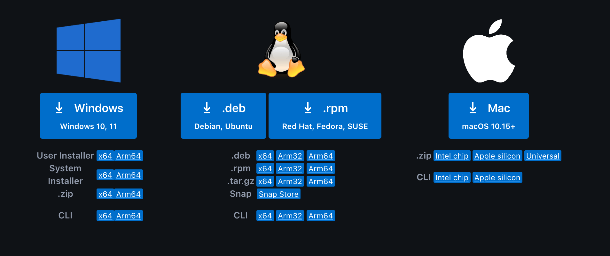
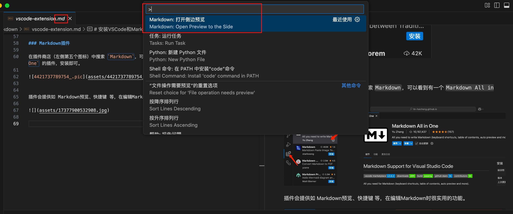
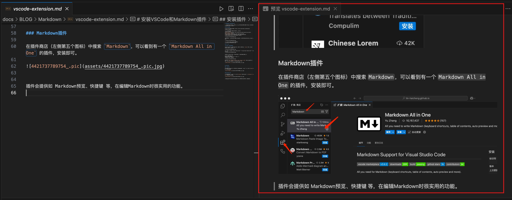

# 安装VSCode和Markdown插件

> 暂时不想安装 VSCode，也可以使用在线的 Markdown编辑器。如 <https://stackedit.io/app#>{target="_blank"}

## 安装 VSCode

VS Code 官方网站下载页面： <https://code.visualstudio.com/Download>{target="_blank"}

按照自己的电脑操作系统选择安装包进行下载。  
我的是macOS系统，其他系统的安装参考菜鸟教程：  
[VSCode Linux 安装](https://www.runoob.com/vscode/vscode-linux-install.html){target="_blank"}  
[VSCode Windows 安装](https://www.runoob.com/vscode/vscode-windows-install.htmlhttps://www.runoob.com/vscode/vscode-windows-install.html){target="_blank"}  

安装完成后打开code，macOS 将提示是否确认打开从互联网下载的程序，单击 Open 按钮即可：  

启动 Visual Studio Code，界面如下：  

## 打开方式  

**我用的是 macOS系统**

1、按下 Command ⌘ 按键，然后按下空格键，在搜索框查找 `Visual`，点击 Visual Studio Code 按钮即可打开：  

2、也可以在启动台查找 Visual Studio Code 图标，找到 Visual Studio Code 图标后，单击它：    

3、如果想在**终端**用命令打开VScode，先打开code里面的命令面板：  

macOS 系统快捷键：⇧⌘P  
Windows/Linux 快捷键: Ctrl + Shift + P  
搜索安装 >shell command:  

然后选择 `Shell Command: Install 'code' command in PATH` 即可为系统 PATH 路径添加了 code 命令的引用，在终端输入`code`就打开**VScode**了。

## 安装插件

### 中文插件

如果需要将 VSCode 调为中文，可以在插件商店（左侧第五个图标）中搜索 `Chinese`，选择中文简体安装即可。  

### Markdown插件

在插件商店（左侧第五个图标）中搜索 `Markdown`，可以看到有一个 `Markdown All in One` 的插件，安装即可。  

插件会提供如 Markdown预览、快捷键 等，在编辑Markdown时很实用的功能。

**预览窗口打开方式**：VScode打开一个md文件，在中间最上面的那个命令行窗口输入一个大于符号`>`，选择打开侧边预览。  

预览窗口如下：  

