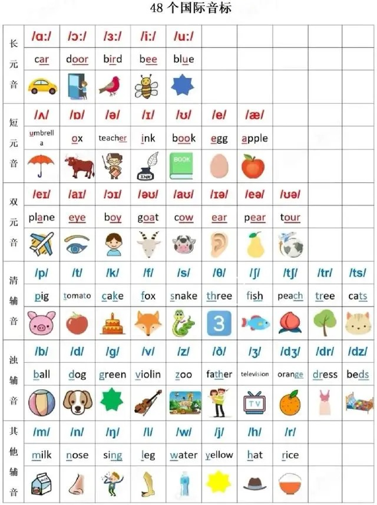
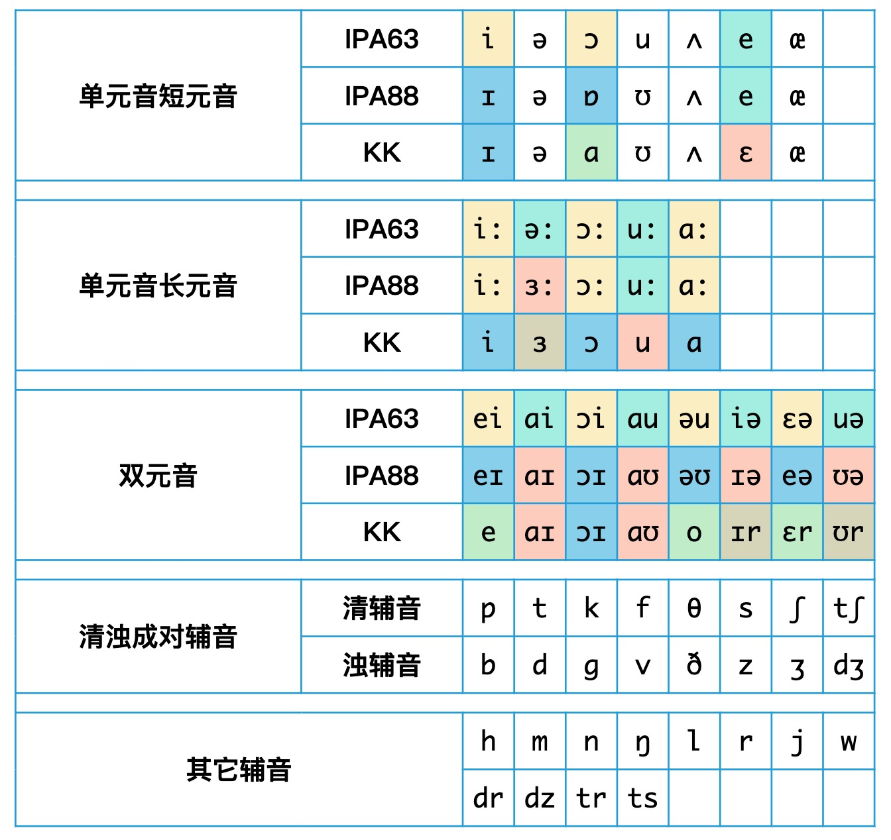
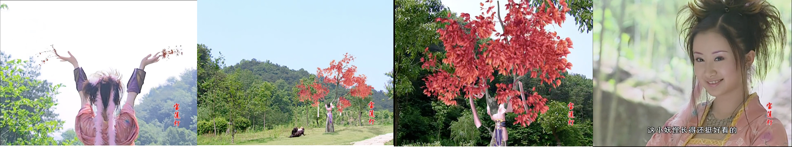

# 音标

学习英语音标的读音，我推荐英语兔的这两个视频。

音标的各个版本，进行详解和详细读音的分集：[英语兔 | 音标的来龙去脉](https://www.bilibili.com/video/BV1iV411z7Nj/?spm_id_from=333.1387.favlist.content.click&vd_source=17c79bc8f684676ab0d3d5f6cb10134a){target="_blank"}

只想知道音标读音的话，可以直接看这个视频一集说完所有读音：[英语兔 | 48个英语音标示范发音](https://www.bilibili.com/video/BV1vi4y1C73C?spm_id_from=333.788.recommend_more_video.0&vd_source=17c79bc8f684676ab0d3d5f6cb10134a){target="_blank"}

## 音标记忆图（IPA88国际音标）

一个音标对应一个单词进行图形化记忆，单词记住之后反推读音，**记住了单词 = 记住了读音**。
{width="65%"}

## IPA63，IPA88，KK，三个版本的音标对照表

（表1）  
{width="65%"}

（表2）  
{width="65%"}

英语音标，至今已经有几套不同的体系，
或许学生时代的时候，教科书往往只教其中一种。造成后来大家在阅读不同地区或者不同时期的文档时，会瞬间觉得,“咦~这音标跟我学的怎么不一样啊？是不是错了？”。

**IPA音标:** 就是国际音标。IPA63是1963年发布的，现在一般把它叫做传统音标；而IPA88是1988年再版的国际音标。现在英式英标以IPA88为准，国际通行的一般也是IPA88。  

**DJ音标:** DJ音标=IPA63音标 + IPA88音标，被称为国际音标IPA是被后人认定的，原本其实是DJ音标的63年和88年的两个版本而已，脱胎于更早的国际音标，而更早的国际音标是很杂很乱的。

**KK音标:** 一般用来标注美音，美音跟英音是有很多差别。

如今，主流的网络词典一般都会选用IPA88音标，有的会同时标注美音和英音。但是这里美音，多数用的是IPA88+来标注(不是纯粹的IPA88，有些融合了KK音标)。使用的时候，需稍微留意下。

## 我的音标

**元音音标**一个音标选定一个简单对应单词很好记忆，但是辅音分**清音** 和**浊音（浊音相当于声带震动的清音）** 还有**其他辅音**。

- 想记忆清浊辅音我觉得有两个方法比较好。

    （1）可以选定单词后脑子里**想象一副场景画面**。

    如：**清音/p/** 和 **浊音/b/**，/p/我的选的单词是'up'有向上的意思、/b/的单词是'ball'意思是球。对应我来说**清可以和干净整洁**联想起来，**浊可以和脏乱**联想。
    想象的画面是跟一个好朋友在一个**斜坡踢球**，斜坡的最下面是一些生活垃圾，他站在斜坡的最上面把球往下踢，我负责截到球后**向上踢(想象把up这个单词印到斜坡上)**。开始成功截到了几次球，但哪有次次成功的，像第五次我就没截到，球越过了我滚到了哪些生活垃圾的污水旁边，变成了一个**脏球**(把英语单词ball印到球上，这样就把球这个单词和浊关联到了一起)，这让有些小洁癖的我不由得在风中凌乱了。

    （2）找到记忆里和音标单词里**能触发你自己联想的单词**，记忆最好的方法就是**以熟记新**，不限于画面或者图片，诗歌文字之类也可以。
    如：清音/tr/对应的单词tree树，浊音/dr/对应的单词dress连衣裙。使用的是小时候印象深刻的经典电视剧**宝莲灯**，其中小玉变成一棵穿裙子的树这个片段来进行记忆。至于我为什么会选这个片段呢，咳咳，只能说是印象比较深刻，hhh。

    

    急忙逃命的沉香不慎掉到河里，从水中爬出来后来到一片草地，忽然看到一棵穿着衣服的小树。 原来那树是一只刚出道的小狐狸精——小玉变的，她看到沉香 赶紧变成树木。 沉香疑问树穿着衣服，但自己的衣服也湿了，于是把树上的衣服给扒了下来正要穿上，小玉忙出声要沉香把衣服还给她，沉香以为遇到树精。经过交流小玉施法帮沉香把衣服烘干就给回衣服她，但是沉香担心小玉跟她翻脸，于是衣服烘干后骗小玉说到别处去穿，其实带着她的衣服跑了。